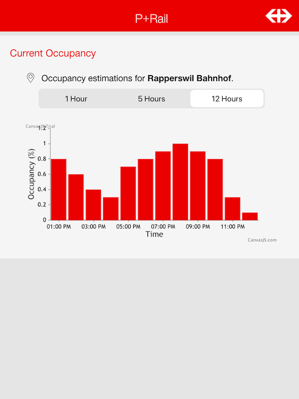
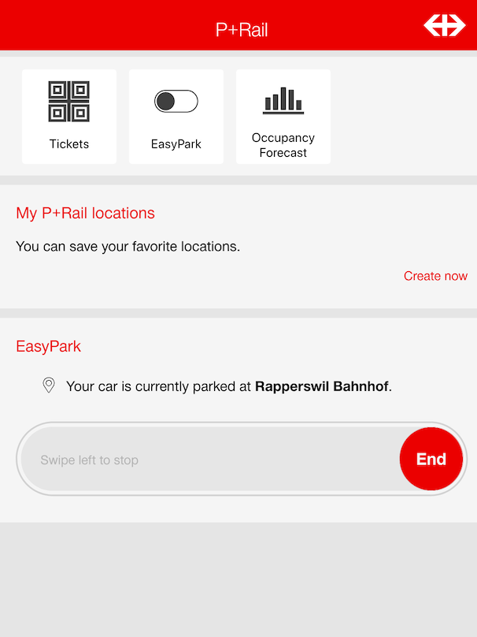

# Case winner of Start Hack 2021: Predictive models for car parking space occupancy for the Swiss federal railways (SBB)

**Challenge**\
With more than 29.000 car parking lots distributed across 600 locations, the SBB is one of the largest parking space owner in Switzerland. For a pilot study, the SBB has equipped two parking sites with sensors to measure and collect parking occupancy rates. Based on this data, the task during the hackathon was to create predictive models to better forecast parking occupancy rates. 

**Solution**\
This repository features the winning solution created during the hackathon and the subsequent research paper for deeper analysis of the proposed machine learning models. The solution is based on a XGBoost model that considers the following data sources:

  * Time-related features
  * Past parking occupancy (lag features)
  * Ticket sales data
  * Weather and public holidays information

The model was tested on real-world data from two parking sites. For a 3-month forecast of each parking site, the model including all features achieved a high accuracy with a mean absolute error of **2.34** and **4.27**, respectively. The hackathon solutions includes consideration on how enduser feedback can be collected and used to calibrate the predictive model.

**Authors**
- [Yvan Bosshard](https://https://www.linkedin.com/in/yvan-bosshard/), ETH Zurich
- [Tiago Salzmann](https://www.linkedin.com/in/tiago-salzmann-888818164/), ETH Zurich
- [Achilleas Mitrotasios](https://www.linkedin.com/in/achilleas-mitrotasios/), University College London
- [Christopher Kindl](https://www.linkedin.com/in/kindl/), University College London


The hackathon was hosted by [startglobal](https://www.startglobal.org/)

## Table of contents
   * [Solution submitted during hackathon](#Solution-submitted-during-hackathon)
      * [Concept](#concept)
      * [Machine learning approach](#machine-learning-approach)
      * [Resources](#resources)
   * [Research paper](#research-paper)
      * [Dependencies and installation](#dependencies)
      * [Data pre-processing](#preprocessing)
      * [Feature extraction](#feature-extraction)
      * [Baseline model](#baseline-model)
      * [Advanced model](#advanced-model)


# Solution submitted during hackathon
### Concept

The core of the application is a web API that provides the user with predictions about the occupancy of a given P+Rail parking site at a given hour, as well as allowing users to give feedback of the perceived parking occupancy, such that the model can be calibrated. Given some machine learning model, a web service instance pulls data from the SBB data API to run an inference. Results are then sent to the front-end, which is an App for purchasing parking tickets (P+Rail App). In the front-end (implemented in React), the data is visualized for different time windows. Users of the P+Rail app are given the option to start and stop their parking session with the help of a data input slider. Nudging can be applied to increase user contribution, such as reductions in parking fares (pay per use) or through technological means (e.g. requiring the user by service agreement to register the vehicle upon arrival). Once users finish a parking session, a pop-up asks the user to enter the perceived occupancy of the facility in a convenient manner. which he/she will be rewarded for by loyalty points (that could be used for discounts or other amenities). This user input is fed back through the API, where the data is collected and regularly used to reinforce the model by retraining it with the most recent data and the user inputs. The proposed solution architecture and user interfaces of the front-end can be seen below.

The forecast of the predicted occupancy over the next twelve hours.             |  The EasyPark slider engaged during parking at Rapperswil Bahnhof.         
:-------------------------:|:-------------------------:
  |  

<br><br>
### Machine learning approach (only refers to solutions submitted for hackathon)

During the hackathon, we developed a first approach for a machine learning model. Details are explained in the following. However, a comprehensive and validated approach was developed for the research paper.

We formed the hypothesis that the true occupancy rate of the parking spaces can be approximated by the weighted sum of the ticket sales and the enduser input which we aim to collect. The user inputs will be averaged for a given timeslot.

If the solution is implemented in real life, the weight values can be computed by collecting user input for the parking spaces where the occupancy rate is already being tracked (i.e. Rapperswil) as a first stage and comparing the outputs in terms of correlation or similar. Since at this point we do not have user inputs to work with, simulated it by artificially adding noise to the occupancy rate (Rapperswil) dataset. We then trained a time series model on a the weighted ticket sales data and the simulated user input and finally computed a forecast on an hourly basis. The prediction seem to accurately depict the real occupancy rates, indicating that the assumptions we made are realtively valid.


### Resources

Details about the front-end application:
- [Web-App source code for prototype purposes](https://github.com/christopherkindl/start-hack-2021/blob/main/01_ml/model_training_achi.ipynb)

Links to predictive models developed during hackathon:
- [jupyter notebook holt-winters time-series model](https://github.com/christopherkindl/start-hack-2021/blob/main/01_ml/model_training_achi.ipynb)
- [jupyter notebook Facebook-Prophet time-series model](https://github.com/christopherkindl/start-hack-2021/blob/main/01_ml/model_training_chris.ipynb)

# Research paper

For the paper, we suggested a multi-feature prediction model that is based on several data domains as introduced in the beginning.  XGBoost, an ensemble learning technique based on decision trees, is used as forecasting method as the individual contribution of each feature is the scope and not performance comparision on algorithm level.

The development of the model is based upon the following stages:

**1. Data collection:** [00_data](https://github.com/christopherkindl/start-hack-2021/blob/main/01_ml/model_training_achi.ipynb) already includes pre-processed data, for more details of data acquisition see, for example script [data_fetcher.py](https://github.com/christopherkindl/start-hack-2021/blob/main/01_ml/model_training_achi.ipynb)\
**2. Feature engineering:** [feature_engineering.ipynb](https://github.com/christopherkindl/start-hack-2021/blob/main/01_ml/model_training_achi.ipynb)\
**3. Baseline model:** [baseline_model.ipynb](https://github.com/christopherkindl/start-hack-2021/blob/main/01_ml/model_training_achi.ipynb)\
**4. Advanced model (XGBoost):** [advanced_model.ipynb](https://github.com/christopherkindl/start-hack-2021/blob/main/01_ml/model_training_achi.ipynb)

To run the notebooks, please install the required dependencies.

```bash
pip install requirements.txt
```
